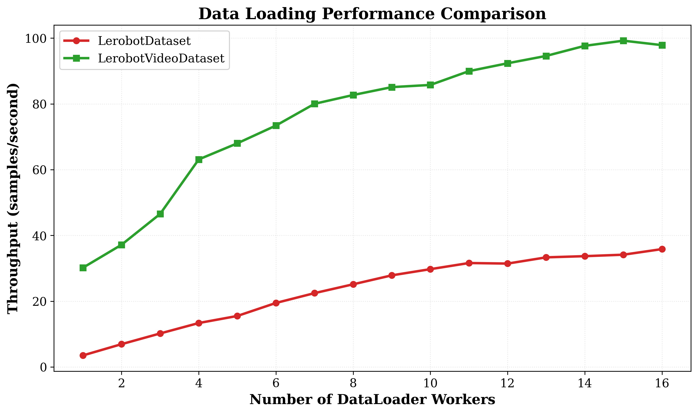

# Benchmark

## 1. Overview

This document provides a comprehensive performance benchmark for `VideoDataset`, a high-efficiency video decoding backend. The tests compare the original `LerobotDataset` against the version integrated with `LerobotVideoDataset` across several key metrics to quantify the improvements.

**Primary Goal:** To demonstrate the significant advantages of `LerobotVideoDataset` over the traditional per-frame image loading method in terms of video decoding speed and data loading throughput.

## 2. Prerequisites

### 2.1 Benchmark Environment

To ensure reproducible and fair results, all tests were conducted in the following fixed environment:

| Component | Specification |
| :--- | :--- |
| **Hardware** | - **CPU:** Intel(R) Xeon(R) Platinum 8468 |
| | - **GPU:**  NVIDIA H100 SXM5 80GB |
| **Docker** | - **Image:** nvcr.io/nvidia/pytorch:25.04-py3 |
| **Software** | - **OS:** Ubuntu 24.04.3 LTS |
| | - **Python:** 3.12.3 |
| | - **PyTorch:** 2.7.0a0+79aa17489c.nv25.4 |
| | - **CUDA:** 12.9 |
| | - **Driver Version:** 560.35.03 |
| **Dataset** | - **Name:**  agibot-world/AgiBotWorld-Alpha |
| | -**Task:** | - **327** |

### 2.2 Video Transcoding Preparation

Since the H100 GPU cannot decode AV1 videos, all test videos were pre-transcoded to H.265 (HEVC) format using the following command:

```bash
ffmpeg -i input.mp4 -r 30 -c:v libx265  -crf 24 -g 8 -keyint_min 8 -sc_threshold 0 -vf "setpts=N/(30*TB)" -bf 0 -c:a copy output.mp4
```

## 3. Benchmark Execution

### **Benchmark Command**

The performance benchmark was executed using the following command:

```bash
cd /path/to/videodataset

export PYTHONPATH=$PYTHONPATH:$(pwd)

python tests/utils/benchmark.py --data /path/to/lerobot_dataset --data-type LeRobotVideoDataset
```

### **Key Parameters**

| Parameter | Value | Description |
| :--- | :--- | :--- |
| **`--data`** | `/path/to/agibot-world` | Path to the dataset |
| **`--data-type`** | `LeRobotVideoDataset` or `LeRobotVideoDataset` | Dataset type (LeRobotVideoDataset or LeRobotDataset) |
| **`--batch-size`** | `16` | Batch size for data loading |
| **`--num-workers`** | `8` | Number of data loader workers to test |
| **`--warmup-steps`** | `2` | Number of warmup steps before timing|

## 4. Benchmark Metrics

We focus on the following metric:

**Data Loading Throughput:**
    - Unit: samples/second
    - Meaning: The number of samples the data loader can provide to the training pipeline per second. This is one of the key bottlenecks affecting training speed.

## 4. Results

### Throughput vs. Number of Workers

<div align="center">
    
</div>
